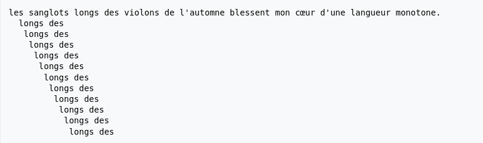

# Test Technique Gymglish 📚💻

Pour le test technique sur le sujet : "Return the number of occurrences of the passed word (case insensitive) in text", voici les détails de ma démarche :

## 1°) 🚀


### Algorithme naïf

**Principe**

L'algorithme naïf consiste à faire glisser le motif le long du texte. Au début, le motif se trouve aligné avec le début du texte. Par exemple, si l'on cherche la chaîne "longs des" dans le texte "les sanglots longs des violons de l'automne blessent mon cœur d'une langueur monotone", on considère l'alignement suivant :

```sh
"les sanglots longs des violons de l'automne blessent mon cœur d'une langueur monotone.longs des"
```

On compare caractère après caractère le motif et le texte. Le premier caractère est 'l'. Mais le deuxième caractère est différent. On fait alors glisser le motif d'une case vers la droite.

On compare à partir du second caractère. Le caractère 'e' et 'l' sont différents. On continue donc à glisser le motif.

Au continue jusqu'à ce que l'alignement coïncide :




J'ai d'abord utilisé une première version native que j'avais déjà réalisée auparavant sur LeetCode, une plateforme d'exercices algorithmiques. Cette version utilise une boucle pour parcourir le texte et vérifier chaque sous-chaîne de la même longueur que le mot recherché. La complexité de cette méthode est O(m\*n). Cet algorithme s'est avéré au final rapide, avec un temps d'exécution d'environ 0,46 secondes aux tests.

## 2°) 🔍

Ensuite, j'ai cherché à optimiser cette solution. J'ai lu de la documentation sur Internet pour trouver le meilleur algorithme et je suis arrivé à la version utilisant l'algorithme de Knuth-Morris-Pratt (KMP). Cet algorithme a une complexité de O(m+n), mais il est légèrement plus lent dans mes tests, avec un temps d'exécution d'environ 0,70 secondes. Expliquer l'algorithme KMP ici serait compliqué, mais vous pouvez trouver des informations détaillées sur sa page Wikipédia : [Algorithme de Knuth-Morris-Pratt](https://fr.wikipedia.org/wiki/Algorithme_de_Knuth-Morris-Pratt). Cette phase de recherche et d'implémentation m'a pris environ 30 à 40 minutes, mais le résultat est un algorithme beaucoup plus optimisé.

📎 J'ai mis en pièce jointe le fichier, ou sinon j'ai fait un GitHub : 

[https://github.com/raanki/GymGlish](https://github.com/raanki/GymGlish)

💻 J'ai utilisé l'IDE PyCharm.
